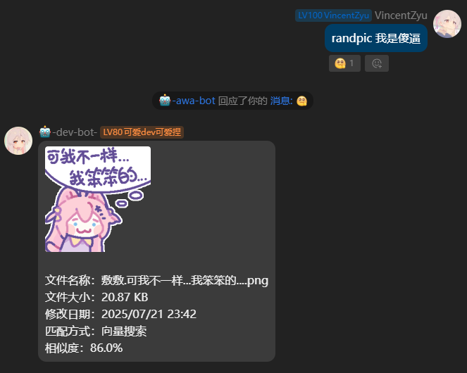

# koishi-plugin-randpic

[](https://www.npmjs.com/package/koishi-plugin-randpic)

🎲 智能随机图片插件 - 从本地文件夹随机选图发送，支持关键词搜索和 AI 语义搜索



## ✨ 功能特性

- 🖼️ **随机发图** - 从指定文件夹随机选择图片发送
- 🔍 **关键词搜索** - 支持按文件名子串匹配搜索
- 🧠 **AI 语义搜索** - 使用本地 Embedding 模型进行向量相似度搜索（可选）
- 👁️ **Ollama 视觉增强** - 使用多模态 AI 分析图片内容，生成描述性 tag，大幅提升搜索效果（可选）
- 📚 **多图库支持** - 可配置多个图片文件夹，每个对应不同指令
- 📁 **递归扫描** - 自动扫描子文件夹中的图片
- 🎨 **自定义输出** - 可自定义图片发送格式模板

## 📦 安装

```bash
npm install koishi-plugin-randpic
# 或
yarn add koishi-plugin-randpic
```

## 🚀 快速开始

### 基础用法

```
randpic              # 随机返回一张图片
randpic 猫咪         # 搜索包含"猫咪"的图片
randpic.index        # 重新索引图片库（启用向量搜索时）
randpic.stats        # 查看图片库统计
randpic.refresh      # 刷新图片缓存
```

### 多图片库配置

可以在「图片库列表」中配置多个指令，每个指令对应不同的图片文件夹：

| 指令名 | 图片文件夹 | 启用 |
|--------|-----------|------|
| randpic | ~/Images | ✅ |
| meme | ~/Memes | ✅ |
| wallpaper | ~/Wallpapers | ✅ |

## 🔍 搜索逻辑

1. **子串匹配**（默认）：优先在文件名中搜索包含关键词的图片
2. **向量搜索**（可选）：如果子串匹配失败且启用了 Qdrant + 本地 Embedding，使用 AI 语义搜索

### 👁️ Ollama 视觉增强（推荐）

启用 Ollama 视觉模型后，索引时会使用多模态 AI（如 moondream、LLaVA）分析图片内容，生成描述性 tag。
这样向量搜索不再依赖文件名，而是基于图片的实际内容，大幅提升搜索效果！

**效果对比：**

| 场景 | 仅文件名索引 | Ollama 视觉增强 |
|------|-------------|----------------|
| 文件名 `IMG_001.jpg`，实际是一只猫 | ❌ 搜索"猫"匹配不到 | ✅ 搜索"猫"可以匹配到 |
| 文件名 `DSC_002.jpg`，实际是风景 | ❌ 搜索"风景"匹配不到 | ✅ 搜索"风景"可以匹配到 |

**工作原理：**
```
索引阶段（增强后）：
扫描图片 → Ollama 视觉模型分析 → 生成描述 tag → 本地 Embedding 转成向量 → 存入 Qdrant

搜索阶段（不变）：
用户输入关键词 → 本地 Embedding 转成向量 → Qdrant 查相似向量 → 返回结果
```

**性能说明：**
- 索引速度：GPU 约 1-3 秒/张，CPU 约 5-15 秒/张
- 搜索速度：不变（毫秒级，Qdrant 直接查向量）
- 索引完成后可关闭 Ollama，搜索不需要它

## 🧪 向量搜索架构

本插件使用两个核心依赖实现 AI 向量搜索：

| 依赖 | 作用 | 说明 |
|------|------|------|
| `@xenova/transformers` | **生成向量** | Transformers.js，在 Node.js 本地运行 AI 模型 |
| `@qdrant/js-client-rest` | **存储 & 搜索向量** | Qdrant 向量数据库客户端 |

### 工作流程

```
┌─────────────────────────────────────────────────────────────┐
│                      索引阶段（基础）                        │
│  randpic.index → 扫描图片 → Transformers.js → 存入 Qdrant   │
└─────────────────────────────────────────────────────────────┘

┌─────────────────────────────────────────────────────────────┐
│                   索引阶段（Ollama 增强）                     │
│  randpic.index → 扫描图片 → Ollama 视觉分析                  │
│       → 生成描述 tag → Transformers.js → 存入 Qdrant        │
└─────────────────────────────────────────────────────────────┘

┌─────────────────────────────────────────────────────────────┐
│                      搜索阶段                                │
│  randpic 关键词 → Transformers.js → Qdrant 相似度搜索       │
└─────────────────────────────────────────────────────────────┘
```

### 支持的 Embedding 模型

| 模型 | 说明 | 向量维度 |
|------|------|---------|
| `Xenova/paraphrase-multilingual-MiniLM-L12-v2` | 🌍 多语言 MiniLM（推荐） | 384 |
| `Xenova/multilingual-e5-small` | 🌏 多语言 E5-small（效果更好） | 384 |
| `Xenova/bge-small-zh-v1.5` | 🇨🇳 中文 BGE-small（中文专用） | 512 |

## 📊 资源占用估算（约 1000 张图片）

### Transformers.js (本地 Embedding 模型)

| 资源 | 首次索引 | 运行时搜索 | 说明 |
|------|----------|------------|------|
| **内存 (RAM)** | ~500MB - 800MB | ~400MB - 600MB | 模型常驻内存 |
| **CPU** | 高 (100%) | 低 (~5-10%) | 索引时密集计算 |
| **索引耗时** | ~8-12 秒 | - | i5-10210U 约 8 秒 |
| **模型缓存** | ~100MB | - | 首次下载后缓存 |

### Qdrant (向量数据库 Docker 容器)

| 资源 | 索引写入 | 运行时搜索 | 说明 |
|------|----------|------------|------|
| **内存 (RAM)** | ~100MB - 200MB | ~50MB - 100MB | 容器内存占用 |
| **CPU** | 低 (~10%) | 极低 (~1%) | 向量搜索很轻量 |
| **磁盘存储** | ~2-5 MB | - | 1000 个向量 + payload |

> 💡 **建议**：内存 < 4GB 的设备建议关闭向量搜索，仅使用子串匹配

## 🐳 Qdrant 部署

Qdrant 是一个高性能向量数据库，用于存储和搜索图片的 Embedding 向量。

### Docker 快速部署

```bash
docker run -d \
  --name qdrant \
  -p 6333:6333 \
  -v /path/to/qdrant_data:/qdrant/storage \
  qdrant/qdrant
```

**参数说明：**
- `-p 6333:6333`：端口映射
- `-v /path/to/qdrant_data:/qdrant/storage`：持久化存储

> ⚠️ **重要提醒**：如果多个 Koishi randpic 插件实例共用同一个 Qdrant 容器，必须为每个实例配置不同的 `collectionName`，否则会导致数据冲突！

📦 **仓库地址**：https://github.com/qdrant/qdrant

## 🦙 Ollama 视觉增强

Ollama 是一个本地 LLM 运行工具，支持多模态视觉模型（如 moondream、LLaVA），可以分析图片内容并生成描述性 tag。

### 前置条件

1. **安装 Ollama**：https://ollama.com
2. **下载视觉模型**：
   ```bash
   # 推荐：LLaVA 7B（效果好，速度适中）
   ollama pull llava:7b
   
   # 轻量级：moondream（速度快，适合 CPU）
   ollama pull moondream
   ```

### 配置步骤

1. 确保 Ollama 服务运行中（默认 `http://127.0.0.1:11434`）
2. 在插件配置中启用「👁️ 启用 Ollama 视觉模型」
3. 配置 Ollama 地址和模型名称（默认 `127.0.0.1:11434`，`moondream`）
4. 运行 `randpic.index` 重新索引图片库

### 性能说明

| 硬件 | 索引速度 | 说明 |
|------|----------|------|
| GPU（推荐） | 约 1-3 秒/张 | Ollama 自动使用 GPU 加速 |
| CPU | 约 5-15 秒/张 | 可以跑，但较慢 |

> 💡 **提示**：索引完成后可关闭 Ollama 服务，搜索阶段不需要它！

### 自定义提示词

你可以在配置中自定义 Ollama 的提示词模板，例如：
```
请详细描述这张图片的内容，包括主体、场景、颜色、动作等关键信息。
用简洁的中文关键词或短语回答，用空格分隔。
```

📦 **Ollama 仓库**：https://github.com/ollama/ollama  
📦 **LLaVA 模型**：https://ollama.com/library/llava

## 🐍 手动下载模型文件

如果 Transformers.js 自动下载失败（网络问题、代理问题等），可以使用插件目录下的 Python 脚本手动下载模型文件。

### 环境变量

| 变量 | 说明 | 示例 |
|------|------|------|
| `HF_PROXY` | 代理地址（优先使用） | `socks5h://127.0.0.1:7890` |

### 运行方法

```bash
# 进入插件 assets 目录
cd /path/to/koishi-plugin-randpic/assets

# 安装依赖
pip install requests[socks]

# 直接运行（自动尝试 127.0.0.1:7890 代理）
python download.py

# 或者指定代理
HF_PROXY=socks5h://127.0.0.1:7890 python download.py
```

**说明：**
- 脚本会自动下载所需的模型文件到当前目录
- 如果 `huggingface.co` 无法访问，会自动尝试 `hf-mirror.com` 镜像
- 下载完成后，确保 `localModelDir` 配置指向正确的 assets 目录

## ⚙️ 配置项

### 图片库配置

| 配置项 | 类型 | 默认值 | 说明 |
|--------|------|--------|------|
| `imageLibraries` | Array | - | 图片库列表，包含指令名、路径、是否启用 |
| `searchSubfolders` | Boolean | `true` | 是否递归搜索子文件夹 |

### Qdrant 配置

| 配置项 | 类型 | 默认值 | 说明 |
|--------|------|--------|------|
| `enableQdrant` | Boolean | `false` | 启用 Qdrant 向量搜索 |
| `qdrantHost` | String | `127.0.0.1` | Qdrant 服务器地址 |
| `qdrantPort` | Number | `6333` | Qdrant 服务器端口 |
| `collectionName` | String | `randpic_images` | Qdrant 集合名称 |

### Embedding 配置

| 配置项 | 类型 | 默认值 | 说明 |
|--------|------|--------|------|
| `enableLocalEmbedding` | Boolean | `false` | 启用本地 Embedding |
| `embeddingModel` | String | `Xenova/paraphrase-multilingual-MiniLM-L12-v2` | 模型选择 |
| `localModelDir` | String | `./assets` | 本地模型目录 |
| `topK` | Number | `5` | 向量搜索返回数量 |
| `similarityThreshold` | Number | `0.3` | 相似度阈值 (0-1) |

### Ollama 视觉模型配置

| 配置项 | 类型 | 默认值 | 说明 |
|--------|------|--------|------|
| `enableOllamaVision` | Boolean | `false` | 启用 Ollama 视觉分析（索引时生成图片描述 tag） |
| `ollamaHost` | String | `127.0.0.1` | Ollama 服务器地址 |
| `ollamaPort` | Number | `11434` | Ollama 服务器端口 |
| `ollamaVisionModel` | String | `moondream` | 视觉模型名称（llava、bakllava、moondream 等） |
| `ollamaTimeout` | Number | `30000` | 请求超时时间（毫秒） |
| `ollamaPrompt` | String | - | 视觉分析提示词模板 |

### 代理配置

| 配置项 | 类型 | 默认值 | 说明 |
|--------|------|--------|------|
| `enableProxy` | Boolean | `false` | 启用代理 |
| `proxyProtocol` | String | `socks5h` | 代理协议 |
| `proxyHost` | String | `127.0.0.1` | 代理地址 |
| `proxyPort` | Number | `7890` | 代理端口 |

### 图片发送配置

| 配置项 | 类型 | 默认值 | 说明 |
|--------|------|--------|------|
| `toBase64` | Boolean | `true` | 转换为 Base64 发送 |
| `outputFormat` | String | - | 输出格式模板 |

#### 输出格式变量

| 变量 | 说明 |
|------|------|
| `${IMAGE}` | 图片本身 |
| `${NAME}` | 文件名 |
| `${SIZE}` | 文件大小 |
| `${TIME}` | 修改日期 |
| `${PATH}` | 文件路径 |
| `${MATCH_TYPE}` | 匹配方式 |
| `${SCORE}` | 相似度分数 |
| `${TAB}` | 制表符 |
